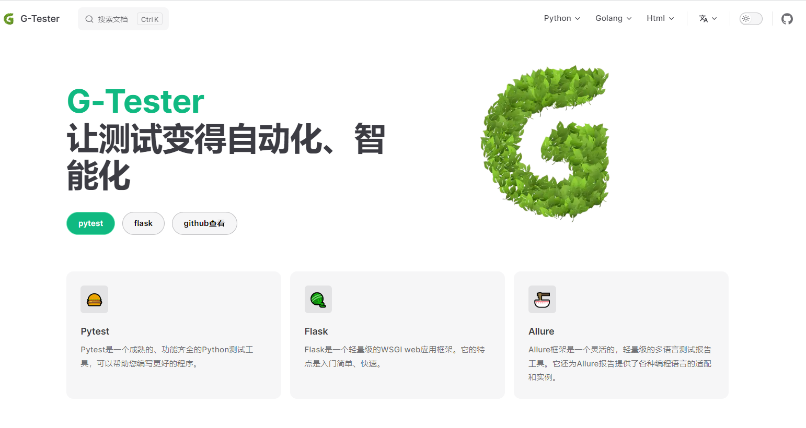

# 📜 docs

## 📝描述

该仓库主要存储与测试相关的文档，如pytest、flask、requests等

**注意**: 该项目可以国际化，支持的语言是 [English](https://github.com/huohuoren4/docs), [简体中文](https://github.com/huohuoren4/docs/tree/zh)。`main`分支为`English`，`zh`分支为`简体中文`

## 🚀运行

拉取服务器代码，切换到项目目录，安装依赖项，然后运行程序

```shell
# 安装 `pnpm`
npm install -g pnpm
# 安装依赖项
pnpm install
# 运行程序
pnpm run docs:dev --port 8081  --host 0.0.0.0
```

## 🌊部署
拉出服务器代码，切换到项目目录，安装依赖项，编译代码，然后运行程序
```shell
# 安装 pnpm
npm install -g pnpm
# 安装依赖项
pnpm install
# 编译代码
pnpm run docs:build
# 运行程序
pnpm run docs:preview --port 8081 --host 0.0.0.0
```

## 🎥截图


## 🧙‍♂️团队

**G-Tester** 是一个测试团队，它的目标是什么: *让测试变得自动化、智能化*
