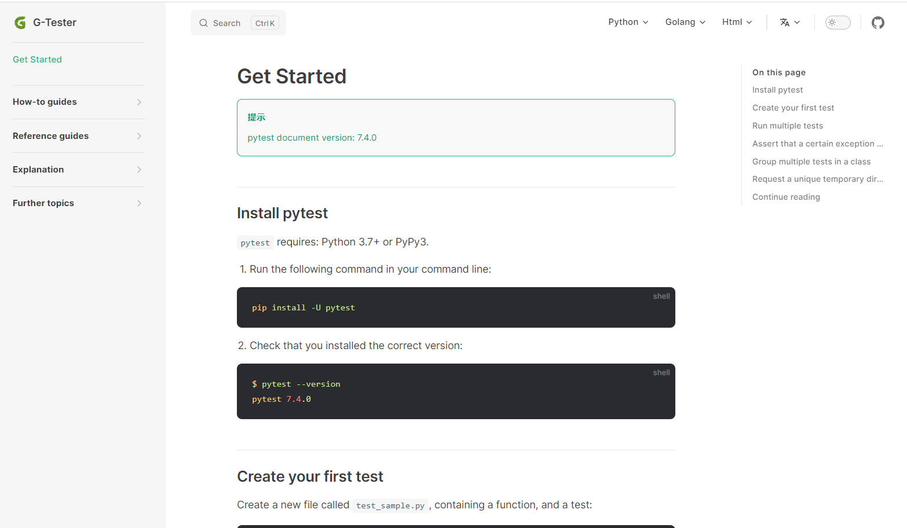

# 📜 docs

## 📝Description

The repository mainly stores documents related to testing, such as pytest, flask, requests, etc

**Note**: The project can be internationalized and the supported languages are `English`, `简体中文`. The `main` branch is `English`, and the `zh` branch is `简体中文`.

[English Demo Site](https://huohuoren4.github.io/)

## 🚀Run

Pull the server code, go to the project directory, install the dependencies, and then run the program

```shell
# install `pnpm`
npm install -g pnpm
# install the dependencies
pnpm install
# run the program
pnpm run docs:dev --port 8080  --host 0.0.0.0
```

## 🌊Deploy
Pull the server code, go to the project directory, install the dependencies, compile the codes and then run the program
```shell
# install pnpm
npm install -g pnpm
# install the dependencies
pnpm install
# compile the codes
pnpm run docs:build
# run the program
pnpm run docs:preview --port 8080 --host 0.0.0.0
```

## 🎥Screenshot



## 🧙‍♂️Team

**G-Tester** is a testing team, and its goal is: *Make Testing Automated And Intelligent*


#### 4. 本周计划
- pytest文档：
    - 英文文档复制：100%
    - 超链接完善：30%
    - 中文文档的翻译：0%

- flask文档：
    - 英文文档复制：0%
    - 超链接完善：0%
    - 中文文档的翻译：0%
